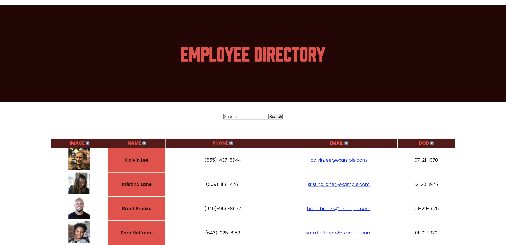

# Unit 19 React Homework: Employee Directory

## Overview

For this assignment, you'll create a employee directory with React. This assignment will require you to break up your application's UI into components, manage component state, and respond to user events.

## User Story

* As a user, I want to be able to view my entire employee directory at once so that I have quick access to their information.

## Business Context

An employee or manager would benefit greatly from being able to view non-sensitive data about other employees. It would be particularly helpful to be able to filter employees by name.

## Acceptance Criteria

Given a table of random users, when the user loads the page, a table of employees should render. 

The user should be able to:

  * Sort the table by at least one category

  * Filter the users by at least one property.

## Screenshot

## GIF

## Commit Early and Often

One of the most important skills to master as a web developer is version control. Building the habit of committing via Git is important for two reasons:

1. Your commit history is a signal to employers that you are actively working on projects and learning new skills

2. Your commit history allows you to revert your code base in the event that you need to return to a previous state

Follow these guidelines for committing:

* Make single purpose commits for related changes to ensure a clean, manageable history. If you are fixing two issues, make two commits

* Write descriptive, meaningful commit messages so that you and anyone else looking at your repository can easily understand its history

* Don't commit half done work, for the sake of your collaborators (and your future self!)

* Test your application before you commit to ensure functionality at every step in the development process

We would like you to have well over 200 commits by graduation, so commit early and often!

## Submission on BCS

You are required to submit the following:

* the URL to the deployed application

* the URL to the Github repository

